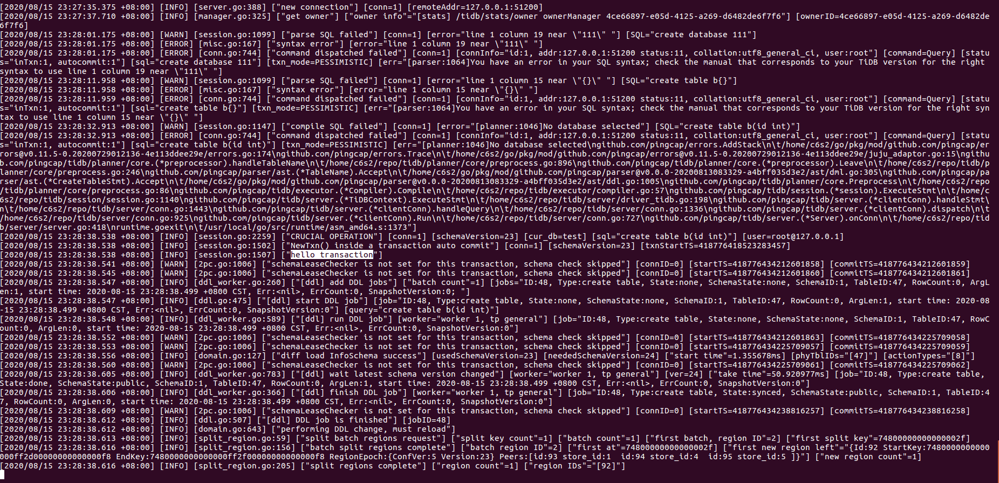

### 构建tidb
* clone repo
* 进入目录make 
* 看到下面这个就行了：
    ```
    CGO_ENABLED=1 GO111MODULE=on go build  -tags codes  -ldflags '-X "github.com/pingcap/parser/mysql.TiDBReleaseVersion=v4.0.0-beta.2-960-g5184a0d" -X "github.com/pingcap/tidb/util/versioninfo.TiDBBuildTS=2020-08-15 12:26:02" -X "github.com/pingcap/tidb/util/versioninfo.TiDBGitHash=5184a0d7060906e2022d18f11532f119f5df3f39" -X "github.com/pingcap/tidb/util/versioninfo.TiDBGitBranch=master" -X "github.com/pingcap/tidb/util/versioninfo.TiDBEdition=Community" ' -o bin/tidb-server tidb-server/main.go
    Build TiDB Server successfully!
    ```

### 构建tikv
* clone repo
* 进入目录 make release （友情提示：风扇噪音跟飞机起飞差不多
* 看到下面这个就行了：
    ```
    Finished release [optimized] target(s) in 18m 27s
    ```

### 构建PD
* clone repo
* 进入目录 make
* 看到这个就行了：
    ```
    CGO_ENABLED=1 go build  -gcflags '' -ldflags '-X "github.com/pingcap/pd/v4/server/versioninfo.PDReleaseVersion=v4.0.0-rc.2-140-g865fbd8" -X "github.com/pingcap/pd/v4/server/versioninfo.PDBuildTS=2020-08-15 02:03:09" -X "github.com/pingcap/pd/v4/server/versioninfo.PDGitHash=865fbd82a028aecfb875a20b932fee3ba4b8c73c" -X "github.com/pingcap/pd/v4/server/versioninfo.PDGitBranch=master" -X "github.com/pingcap/pd/v4/server/versioninfo.PDEdition=Community" -X "github.com/pingcap-incubator/tidb-dashboard/pkg/utils/version.InternalVersion=2020.08.07.1" -X "github.com/pingcap-incubator/tidb-dashboard/pkg/utils/version.Standalone=No" -X "github.com/pingcap-incubator/tidb-dashboard/pkg/utils/version.PDVersion=v4.0.0-rc.2-140-g865fbd8" -X "github.com/pingcap-incubator/tidb-dashboard/pkg/utils/version.BuildTime=2020-08-15 02:03:09" -X "github.com/pingcap-incubator/tidb-dashboard/pkg/utils/version.BuildGitHash=01f0abe88e93"' -tags " swagger_server" -o bin/pd-server cmd/pd-server/main.go
    ```


### 启动PD
* pd 目录下執行
    ```bash
    #!/bin/bash
    bin/pd-server --name="pd" \
            --data-dir="pd" \
            --client-urls="http://127.0.0.1:2379" \
            --peer-urls="http://127.0.0.1:2380" \
            --log-file=pd.log
    ```
* 检查启动状态: ```curl http://localhost:2379/pd/api/v1/members```

### 启动tikv
* tikv 目录下執行
    ```bash
    #!/bin/bash

    target/release/tikv-server --pd-endpoints="127.0.0.1:2379" \
        --addr="127.0.0.1:20160" \
        --status-addr="127.0.0.1:20181" \
        --data-dir=tikv1 \
        --log-file=tikv1.log &
    target/release/tikv-server --pd-endpoints="127.0.0.1:2379" \
        --addr="127.0.0.1:20161" \
        --status-addr="127.0.0.1:20182" \
        --data-dir=tikv2 \
        --log-file=tikv2.log &
    target/release/tikv-server --pd-endpoints="127.0.0.1:2379" \
        --addr="127.0.0.1:20162" \
        --status-addr="127.0.0.1:20183" \
        --data-dir=tikv3 \
        --log-file=tikv3.log &
    ```
### 启动tidb
* tidb目录下建一个config.toml
    * 可以从[这里](https://github.com/pingcap/tidb/blob/master/config/config.toml.example)或者config目录里copy 

* 启动：
  ```bash
  bin/tidb-server --store=tikv     --path="127.0.0.1:2379"     --log-file=tidb.log  --config=config.toml &
  ```
* 最后看看日志就行了


### 检查整体启动状态
* pd目录下执行这个，看看 tikv是不是都起来了
    ```bash
    bin/pd-ctl store -u http://127.0.0.1:2379 
    ```
* 连下tidb，能连上就OK了 ：```mysql -h 127.0.0.1 -P 4000 -u root ```
* 构建&启动到此完成

### transaction 开始输出 “hello transaction”
session/session.go -> NewTxn

