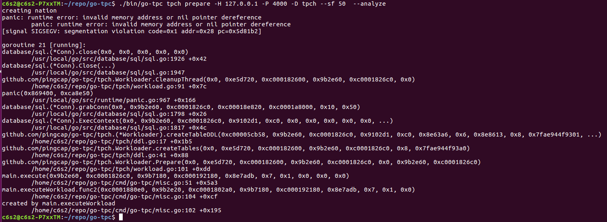

### 机器配置
单机
i5-8400
16G RAM
128 SSD

### 启动配置
```
 # # Global variables are applied to all deployments and used as the default value of
# # the deployments if a specific deployment value is missing.
global:
  user: "c6s2"
  # ssh_port: 22
  deploy_dir: "/tidb-deploy"
  data_dir: "/tidb-data"

# server_configs:
#   tikv:
#     readpool.unified.max-thread-count: <The value refers to the calculation formula result of the multi-instance topology document.>
#     readpool.storage.use-unified-pool: false
#     readpool.coprocessor.use-unified-pool: true
#     storage.block-cache.capacity: "<The value refers to the calculation formula result of the multi-instance topology document.>"
#     raftstore.capacity: "<The value refers to the calculation formula result of the multi-instance topology document.>"
#   pd:
#     replication.location-labels: ["host"]

pd_servers:
  - host: localhost

tidb_servers:
  - host: localhost
    port: 4000
    status_port: 10080

tikv_servers:
  - host: localhost
    port: 20160
    status_port: 20180
  - host: localhost
    port: 20161
    status_port: 20181
  - host: localhost
    port: 20162
    status_port: 20182


monitoring_servers:
  - host: localhost

grafana_servers:
  - host: localhost

alertmanager_servers:
  - host: localhost
```

### dash board & grafana board
TiDB的从dash board能看
统计信息缺TiKV的部分，可能跟本地起了3个TiKV有关系？？？

#### TIDB

#### TIKV


### 调参
缺乏board显示的统计信息，从top看TiKV 3个实例有一个实例的CPU使用率比其它的TiKV高，大概116% vs 25%的样子。本地只启动了1个TiDB，TiDB进程的CPU使用率比TiKV最高的低一点点。可能TiKV RaftStore消耗的CPU资源比较多。

### sysbench

```
c6s2@c6s2-P7xxTM:~/tidb-hp-homeworkds/week2$ sh run-sysbench.sh 
sysbench 0.4.12:  multi-threaded system evaluation benchmark

Creating table 'sbtest'...
ALERT: failed to execute MySQL query: `CREATE TABLE sbtest (id INTEGER UNSIGNED NOT NULL AUTO_INCREMENT, k integer UNSIGNED DEFAULT '0' NOT NULL, c char(120) DEFAULT '' NOT NULL, pad char(60) DEFAULT '' NOT NULL, PRIMARY KEY  (id) )  /*! ENGINE=innodb */`:
ALERT: Error 1050 Table 'test.sbtest' already exists
FATAL: failed to create test table
sysbench 0.4.12:  multi-threaded system evaluation benchmark

Running the test with following options:
Number of threads: 3

Doing OLTP test.
Running mixed OLTP test
Using Special distribution (12 iterations,  1 pct of values are returned in 75 pct cases)
Using "BEGIN" for starting transactions
Using auto_inc on the id column
Maximum number of requests for OLTP test is limited to 10000
Threads started!
Done.

OLTP test statistics:
    queries performed:
        read:                            40004
        write:                           50003
        other:                           20001
        total:                           110008
    transactions:                        10000  (84.13 per sec.)
    deadlocks:                           1      (0.01 per sec.)
    read/write requests:                 90007  (757.24 per sec.)
    other operations:                    20001  (168.27 per sec.)

Test execution summary:
    total time:                          118.8626s
    total number of events:              10000
    total time taken by event execution: 356.4923
    per-request statistics:
         min:                                 13.92ms
         avg:                                 35.65ms
         max:                                336.35ms
         approx.  95 percentile:              56.69ms

Threads fairness:
    events (avg/stddev):           3333.3333/1.25
    execution time (avg/stddev):   118.8308/0.01

c6s2@c6s2-P7xxTM:~/tidb-hp-homeworkds/week2$ 
```

### tpc
not working


### ycsb
```
c6s2@c6s2-P7xxTM:~/repo/go-ycsb$ ./bin/go-ycsb load mysql -P workloads/workloada -p readcount=1000000000 -p mysql.host=127.0.0.1 -pmysql.port=4000 --threads 256 -pmysql.password=test
***************** properties *****************
"dotransactions"="false"
"insertproportion"="0"
"requestdistribution"="uniform"
"operationcount"="1000"
"mysql.password"="test"
"updateproportion"="0.5"
"mysql.port"="4000"
"readallfields"="true"
"recordcount"="1000"
"readcount"="1000000000"
"scanproportion"="0"
"readproportion"="0.5"
"mysql.host"="127.0.0.1"
"workload"="core"
"threadcount"="256"
**********************************************
INSERT - Takes(s): 10.0, Count: 768, OPS: 76.9, Avg(us): 12265, Min(us): 442, Max(us): 38739, 99th(us): 29000, 99.9th(us): 39000, 99.99th(us): 39000
Run finished, takes 13.660765325s
INSERT - Takes(s): 13.7, Count: 768, OPS: 56.2, Avg(us): 12265, Min(us): 442, Max(us): 38739, 99th(us): 29000, 99.9th(us): 39000, 99.99th(us): 39000
c6s2@c6s2-P7xxTM:~/repo/go-ycsb$ ./bin/go-ycsb run mysql -P workloads/workloada -p readcount=1000000000 -p mysql.host=127.0.0.1 -pmysql.port=4000 --threads 256 -pmysql.password=test
***************** properties *****************
"readcount"="1000000000"
"readallfields"="true"
"threadcount"="256"
"recordcount"="1000"
"dotransactions"="true"
"operationcount"="1000"
"requestdistribution"="uniform"
"updateproportion"="0.5"
"insertproportion"="0"
"mysql.port"="4000"
"mysql.host"="127.0.0.1"
"mysql.password"="test"
"readproportion"="0.5"
"scanproportion"="0"
"workload"="core"
**********************************************
Run finished, takes 344.689486ms
READ   - Takes(s): 0.3, Count: 371, OPS: 1263.2, Avg(us): 12938, Min(us): 320, Max(us): 53531, 99th(us): 46000, 99.9th(us): 54000, 99.99th(us): 54000
UPDATE - Takes(s): 0.3, Count: 397, OPS: 1257.2, Avg(us): 39273, Min(us): 1104, Max(us): 240850, 99th(us): 193000, 99.9th(us): 241000, 99.99th(us): 241000
```

